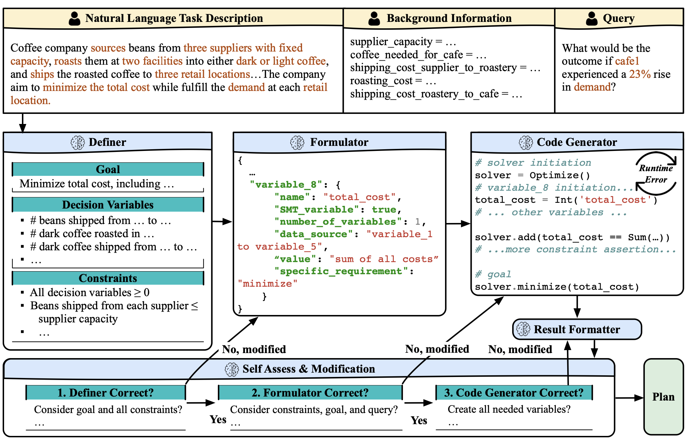

# Planning Anything with Rigor: General-Purpose Zero-Shot Planning with LLM-based Formalized Programming
Codes and Dataset for the Paper "[Planning Anything with Rigor: General-Purpose Zero-Shot Planning with LLM-based Formalized Programming (ICLR'25)](https://arxiv.org/pdf/2410.12112)".

## Framework


## Setup Environment

1. Create a conda environment and install dependency:
```bash
conda create -n llmfp python=3.9
conda activate llmfp
pip install -r requirements.txt
```

2. Data:
* OptiGuide (from public repo https://github.com/microsoft/OptiGuide) contains Coffee, Workforce, and Facility queries
* LLMs-Planning (from public repo https://github.com/karthikv792/LLMs-Planning, and we processed into natural language) contains Blocksworld, Mystery Blocksworld queries
* Task Allocation and Warehouse queries are generated automatically when running test script in pipelines.
* Movie and Gripper queries (from public repo https://github.com/minecraft-saar/autoplanbench) are included in ```database```.

## Running
For every test script in pipelines, run test_xxx.py to run LLMFP on certain task. For example, the command to run coffee task is ```python pipelines/combinatorial/test_coffee.py```. You can also change the index to specify queries to start or end. 

Note the prompts included in the files are same as the experiments in our paper, specifically for Claude (We use anthropic.claude-3-5-sonnet-20240620-v1:0)

In addition, the current code utlizes AWS to access Claude, you might want to switch to your own function to call Claude in openai_func.py. 

## Evaluations
All combinatorial runs generate optimal answers along with LLM generated answer. However, sometimes the formats of the answers (for both baselines and LLMFP) could be different thus is hard to directly evaluate. We will update the codebase with our evaluation scripts soon, but you can also develop your own evaluation scripts to adjust the tolerance. 

We use VAL (https://github.com/KCL-Planning/VAL?tab=readme-ov-file) to evaluate PDDL runs. We will update the codebase with evluation scripts soon.

## Prompts
The prompts we used are included at top of the testing scripts.


## Citation
```md
@article{hao2024planning,
  title={Planning Anything with Rigor: General-Purpose Zero-Shot Planning with LLM-based Formalized Programming},
  author={Hao, Yilun and Zhang, Yang and Fan, Chuchu},
  journal={arXiv preprint arXiv:2410.12112},
  year={2024}
}
```
